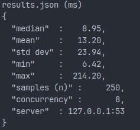

# faf-dns-bench

A (linux-only) tool to benchmark DNS resolution.

Ensure you flush your DNS cache before each use otherwise you'll hit cached answers which invalidate the results.

Sample Output:



## How To Use This

`cargo +nightly run --release`

```
FaF DNS Bench - A DNS Resolution Benchmarker

Usage: faf-dns-bench [OPTIONS]

Options:
  -d, --debug            enable debug output [default: false]
  -s, --server <SERVER>  e.g. 1.1.1.1 [default: system default is parsed using `nslookup .`]
  -p, --port <PORT>      [default: 53]
  -h, --help             Print help
  -V, --version          Print version
```

## Code Tour

Everything is crammed into `main.rs` at the moment. Even so, it should be fairly easy to follow. I'll refactor it 'later'

## Contributions

Contributions are welcome, but please discuss before submitting a pull request. If a discussion leads to a pull request, please reference the \#issue in the pull request. Unsolicited pull requests will not be reviewed nor merged.

Any and all contributions, unless otherwise specified, will be licensed under the license specified by this project (below). All contributors agree to automatically and irrevocably relicense their code to match the project license if the project license changes. All contribitors, by submitting contributions as a pull request (or in any other form), agree to these terms. Any license changes will occur as a bump in versioning and the previous license will remain in effect for the previous version.

## License

All code is licensed under AGPL 3.0 unless an individual source file specifies otherwise.

If you don't like the license, convince me.
