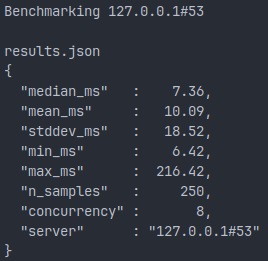

# faf-dns-bench

A crossplatform tool to benchmark DNS resolution.

Ensure you flush your DNS cache before each use otherwise you'll hit cached answers which invalidate the results.

Sample Output:



## How To Use This

`cargo +nightly run --release`

```
FaF DNS Bench - A DNS Resolution Benchmarker

Usage: faf-dns-bench [OPTIONS]

Options:
  -d, --debug            enable debug output [default: false]
  -s, --server <SERVER>  e.g. 1.1.1.1 [default: system default is parsed using `nslookup .`]
  -p, --port <PORT>      [default: 53]
  -h, --help             Print help
  -V, --version          Print version
```

## Code Tour

Everything is crammed into `main.rs` at the moment. Even so, it should be fairly easy to follow. I'll refactor it 'later'

## Contributions

Contributions are welcome, but please discuss before submitting a pull request. If a discussion leads to a pull request, please reference the \#issue in the pull request. Unsolicited pull requests will not be reviewed nor merged.

## License

All code is licensed under AGPL 3.0 unless an individual source file specifies otherwise.
